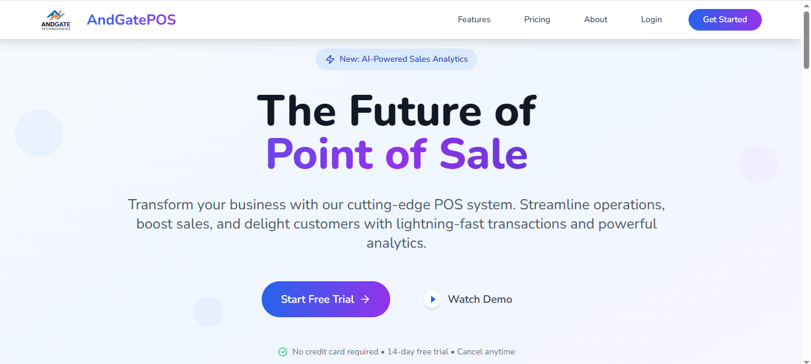

<p align="center">
  
</p>
<h1 align="center">🏪 AndgatePOS</h1>

<p align="center">
  <b>A modern Point of Sale (POS) web application built with Next.js, React, TailwindCSS & Redux Toolkit.</b>
</p>

<p align="center">
  <!-- Badges -->
  
  
  
  
  
</p>

---


## 🚀 Features

-   Store management (Products, Categories, Suppliers, Staff, Purchases, Orders, Invoices )
-   Authentication (Login, Register, Role-based access)
-   POS dashboard with charts & reports
-   Datatables with advanced filtering & export
-   Multi-language support (i18n)
-   Responsive UI with Tailwind + Mantine

---

## 📂 Folder Structure

andgate-pos/
├── app/ # Next.js App router (pages, layouts, auth, modules)
├── components/ # Reusable React components (charts, forms, tables etc.)
├── public/
│ ├── assets/ # Static assets (css, js, vendor libs, icons, etc.)
│ └── images/ # App logos, banners, product images
├── theme.config.tsx # Theme configuration
├── tailwind.config.js # Tailwind CSS configuration
├── package.json # Project dependencies
├── tsconfig.json # TypeScript configuration
└── README.md # Project documentation
⚠️ **Excluded folders:**

-   `.next/` (Next.js build output)
-   `node_modules/` (Dependencies)
-   `dist/` (Build artifacts if any)

---

## 🛠️ Tech Stack

-   **Frontend:** Next.js 14, React 18, TailwindCSS 3, Mantine UI, Redux Toolkit
-   **Database:** MySQL
-   **Other Tools:** i18n, React ApexCharts, React Toastify, FullCalendar

---

## ⚙️ Installation

```bash
git clone <your-repo-link>
cd andgate-pos
npm install
npm run dev
```

🔗 Links

    - Frontend Source Code: Click Here

    - Backend Source Code: Click Here

    - Sample Database File: Download

    - Live Site: Visit Now

📸 Screenshots
